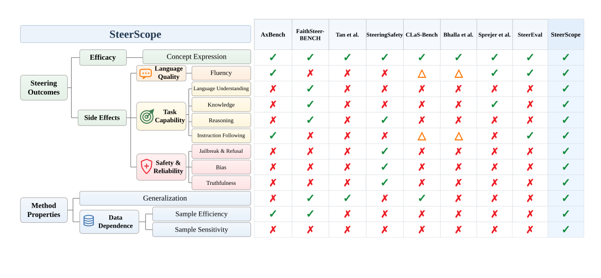
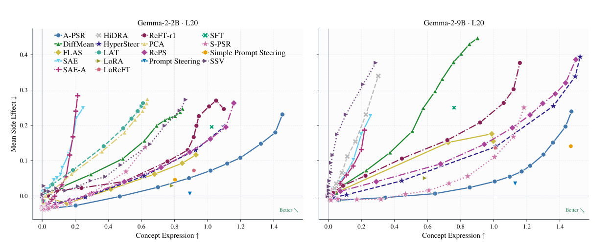

# SteerScope: A Holistic Evaluation Suite for LLM Steering

*Official code for the paper **“Does Steering Break Your Model? A Multi-Dimensional Evaluation Suite for LLM Steering Methods.”***

<a href="https://arxiv.org/abs/2610.07722"></a>
<a href="https://yht0511.github.io/SteerScope/"></a>
<a href="LICENSE"></a>
<a href="https://www.python.org/"></a>

SteerScope is a comprehensive, multi-dimensional evaluation suite for LLM steering, organized around two questions: **what steering changes** and **when those changes hold**. It evaluates target efficacy, side effects, generalization, and training-data dependence while characterizing efficacy–side-effect trade-offs across steering strengths.

<p align="center">
  
</p>

## Coverage

- **15 metrics** for efficacy, language quality, task capability, safety, generalization, and data dependence
- **23 methods and baselines**, plus a random control
- **500 concepts** from the GemmaScope concept vocabulary
- **Gemma-2-2B-it** and **Gemma-2-9B-it**
- Resumable generation, training, evaluation, and analysis

| Family | Methods |
|---|---|
| Optimization-free | DiffMean, PCA, LAT, Spherical Steering, HiDRA, AUSteer, SAE, SAE-A |
| Directly optimized | Linear Probe, SSV, ReFT-r1, LoReFT, A-PSR, S-PSR, RePS, ODESteer, StepODESteer |
| Hypernetwork-based | HyperSteer, FLAS |
| Baselines | Prompt Steering, Simple Prompt Steering, LoRA, SFT |

## Results

<p align="center">
  
</p>

Across both model scales, no evaluated activation-steering method achieves higher target efficacy than Prompt Steering without greater composite side effects.

[Explore the project website →](https://yht0511.github.io/SteerScope/#results)

## Quick start

SteerScope requires Linux, NVIDIA GPUs, Python 3.12, and access to the gated Gemma 2 weights. Jailbreak evaluation also requires `meta-llama/Llama-3.1-8B-Instruct`.

```bash
git clone https://github.com/yht0511/steerscope.git
cd steerscope
bash scripts/setup.sh
cp .env.example .env
```

Set `HF_TOKEN` and the generation and judge API credentials in `.env`, then run the compact 10-concept profile:

```bash
set -a
source .env
set +a
./scripts/run_2b_l20_10concepts.sh
```

This profile evaluates 20 methods plus the random control on Gemma-2-2B-it and uses two GPUs by default. Resource settings are in [`2b_l20_10concepts.yaml`](steerscope/sweep/paper/scheduler_configs/2b_l20_10concepts.yaml).

## Reproduce the paper

| Backbone | Layer | Command |
|---|---:|---|
| Gemma-2-2B-it | 10 | `./scripts/run_2b_l10.sh` |
| Gemma-2-2B-it | 20 | `./scripts/run_2b_l20.sh` |
| Gemma-2-9B-it | 20 | `./scripts/run_9b_l20.sh` |
| Gemma-2-9B-it | 31 | `./scripts/run_9b_l31.sh` |

The full profiles were run on 8 × NVIDIA A100 GPUs. Results are written to `outputs/paper/<model>/<layer>/`.

Regenerate and validate experiment configurations:

```bash
.venv/bin/python steerscope/sweep/paper/generate_configs.py
.venv/bin/python steerscope/sweep/paper/validate_configs.py
```

Run the analysis notebook after the 2B/l20 and 9B/l20 profiles finish:

```bash
.venv/bin/jupyter lab steerscope/sweep/paper/scheduler_metrics_analysis.ipynb
```

## Extend SteerScope

Add steering methods under `steerscope/models/` and evaluators under `steerscope/evaluators/`. See [the extension guide](steerscope/README.md) for the integration steps.

## Tests

```bash
.venv/bin/python -m pytest steerscope/tests/unit_tests
```

## License

SteerScope is released under the [Apache License 2.0](LICENSE).
